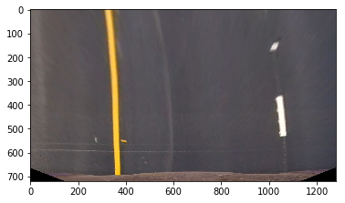

## **Advanced Lane Finding Project**


## Overview

This project's goal is to write a software pipeline to identify the lane boundaries in a video from a front-facing 
camera on a car.

The steps of this project are the following:

* Compute the camera calibration matrix and distortion coefficients given a set of chessboard images.
* Apply a distortion correction to raw images.
* Apply a perspective transform ("birds-eye view").
* Use color transforms, gradients, etc., to create a thresholded binary image.
* Detect lane pixels and fit to find the lane boundary.
* Determine the curvature of the lane and vehicle position with respect to center.
* Warp the detected lane boundaries back onto the original image.
* Output visual display of the lane boundaries and numerical estimation of lane curvature and vehicle position.


## Camera Calibration and Distortion Correction

Today's cheap pinhole cameras introduces a lot of distortion to images. The transformation of a 3D object in the real 
world to a 2D image isn't perfect. We have to correct image distortion because it changes the apparent size, or shape 
of an object and more importantly it makes objects appear closer or farther away than they actually are.

More on this issue in [OpenCV docs calibration section](http://docs.opencv.org/3.1.0/dc/dbb/tutorial_py_calibration.html)

According to this section, there are two main steps to this process: use chessboard images to obtain image points 
and object points, and then use the OpenCV functions `cv2.calibrateCamera()` and `cv2.undistort()` to compute the 
calibration and undistortion. To find pattern in chess board, we use `cv2.findChessboardCorners()`. The code for 
camera calibration parameters such as distortion coefficients and camera calibration matrix could be found in 
`calibration_parameters.ipynb`.

Given picture of chessboard:


Found corners:


We get undistorted image:


Code:

```python
# chessboard size
pattern = (9, 6)
objpoints = [] # 3d point in real world space
imgpoints = [] # 2d points in image plane
objp = np.zeros((pattern[0] * pattern[1], 3), np.float32)
objp[:,:2] = np.mgrid[0:pattern[0],0:pattern[1]].T.reshape(-1,2)
# step through the list of chessboard images and search for corners
calibration_imgs = []
for img in calib_imgs:
    img = cv2.cvtColor(img, cv2.COLOR_RGB2GRAY)
    # find the chessboard corners
    ret, corners = cv2.findChessboardCorners(img, pattern, None)
    # if found, add object points, image points
    if ret == True:
        objpoints.append(objp)
        imgpoints.append(corners)
# get parameters
ret, mtx, dist, rvecs, tvecs = cv2.calibrateCamera(objpoints, imgpoints, shape[::-1], None, None)

# define function for undistortion
def undistort(img):
    return cv2.undistort(img, mtx, dist, None, mtx)
```


## Perspective Transform

After we computed camera calibration parameters let's use them to undistort input images.

Example:


Next step is to apply perspective transformation technique and get so-called "birds-eye view". This makes further 
processing easier as any irrelevant information about background is removed from the warped image. In order to achieve 
desired result, first we need to find source and destination points for  the function `cv2.getPerspectiveTransform()`.

| Source        | Destination   | 
|:-------------:|:-------------:| 
| 550, 480      | 300, 0        | 
| 200, 720      | 300, 720      |
| 1110, 720     | 1000, 720     |
| 740, 480      | 1000, 0       |


Then we can perform warping using `cv2.warpPerspective()` function and transformation matrix `M` that we got from 
previous step.



Code:

```python
def transform_params():
    s_pts = np.array(((550, 480), (740, 480), (1110, 720), (200, 720)), np.float32)
    d_pts = np.array(((300, 0), (1000, 0), (1000, 720), (300, 720)), np.float32)
    M = cv2.getPerspectiveTransform(s_pts, d_pts)
    Minv = cv2.getPerspectiveTransform(d_pts, s_pts)
    return M, Minv

def warp(img, M):
    return cv2.warpPerspective(img, M, (img.shape[1], img.shape[0]))
```


## Color and Gradient Thresholding

Let's use a combination of color and gradient thresholds to generate a binary image. The task is to filter out all 
unnecessary iformation and highlight yellow and white lane lines. By trial and error I found that the best combination
that worked for me was using 'L' and 'B' channels of LAB color-space with thresholding the gradient of the 'x' and 'y' 
component along with the magnitude of the gradient. Also, I found out that using contrast correction of initial image 
helps to fight excessive darkness or brightness. In addition, we can use some 
[morphological transformations](http://docs.opencv.org/3.0-beta/doc/py_tutorials/py_imgproc/py_morphological_ops/py_morphological_ops.html) 
to highlight lines of interest even more and remove noise.

Resulting image:


Code:

```python
def warp(img, M):
    # perform contrast correction first
    img = cv2.cvtColor(img, cv2.COLOR_RGB2YUV)
    img[:,:,0] = cv2.equalizeHist(img[:,:,0])
    img = cv2.cvtColor(img, cv2.COLOR_YUV2RGB)
    return cv2.warpPerspective(img, M, (img.shape[1], img.shape[0]))

# color part
def color_thresh(img):
    lab = cv2.cvtColor(img, cv2.COLOR_RGB2LAB)
    L = lab[:,:,0]
    B = lab[:,:,2]
    B = cv2.morphologyEx(B, cv2.MORPH_TOPHAT, np.ones((25,25),np.uint8))
    thresh_b = (5, 100)
    thresh_l = (245, 255)
    color = np.zeros_like(L)
    cond1 = (L > thresh_l[0]) & (L <= thresh_l[1])
    cond2 = (B > thresh_b[0]) & (B <= thresh_b[1])
    color[cond1 | cond2] = 1
    return color

def apply_colorgrad(img):
    # gradient part
    sobelx = sobelxy(img, 'x', sobel_kernel=15, thresh=50)
    sobely = sobelxy(img, 'y', sobel_kernel=15, thresh=50)
    mag = magnitude(img, sobel_kernel=15, thresh=50)
    grad = np.zeros_like(sobelx)
    cond_xy = (sobelx == 1) & (sobely == 1)
    grad[cond_xy | (mag == 1)] = 1
    # color part
    color = color_thresh(img)
    # combine color and gradient
    combined = np.zeros_like(grad)
    combined[(color == 1) | (grad == 1)] = 1
    combined = cv2.erode(combined, np.ones((7,7),np.uint8), iterations=1)
    return combined
```


## Lines Detection

Now we have all we need to detect lane lines. We can fit a curve for each line with a second degree polynomial 
function **`x = A*y**2 + B*y + C`**. In order to find coefficients A, B, C we use `numpy.polyfit()` function. 
Also, we use a line finding method *peaks in a histogram*. Let's first take a histogram along all the columns in 
the lower half of the image like this `histogram = np.sum(img[int(img.shape[0]/2):,:], axis=0)`:


With this histogram we can add up the pixel values along each column in the image. In our thresholded binary image 
pixels are either 0 or 1, so the two most prominent peaks in this histogram will be good indicators of the x-position 
of the base of the lane lines. We can use that as a starting point for where to search for the lines. From that point, 
let's use a sliding window, placed around the line centers, to find and follow the lines up to the top of the frame. 

And we get this:


## Radius of Curvature and Offset

To calculate curvature of the lane, we use this equation: 

 

In code curvature and offset calculation looks like this:

```python
lane_width = line_x_inds[-1] - line_x_inds[-1]
offset = line_x_inds[-1] + lane_width / 2 - img.shape[1] / 2 

def curvature(binary_image, x, lane_width):
    ploty = np.linspace(0, binary_image.shape[0]-1, binary_image.shape[0])
    y_eval = np.max(ploty)
    # conversion in x and y from pixels space to meters
    dashed_line_length = 150 # in pixels
    ym_per_pix = 3 / dashed_line_length # dashed lane line in real world is 3m
    self.xm_per_pix = 3.7 / lane_width # lane width in real world is 3.7m

    # fit new polynomials to x,y in world space
    cr = np.polyfit(ploty*ym_per_pix, x*self.xm_per_pix, 2)
    # radius of curvature in meters
    curverad = ((1 + (2*cr[0]*y_eval*ym_per_pix + cr[1])**2)**1.5) / np.absolute(2*cr[0])        
    return curverad
```

## Final Result

After all steps we draw lane, lane lines, calculated radius of curvature and offset and information images (on the top 
right corner of original image) representing warped "birds-eye view" and drawn detected lines.


## Pipeline for Video Processing

In order to process video frame by frame we put our pipeline into one class **`LaneTracker`**. Also, we want lines to be 
drawn as smooth as possible an avoid jittering, and to do this let's use buffer and if we can't find lines on given 
frame we use mean of previously saved lines.


## Conclusion

In conclusion, we used OpenCV for calibrating camera and image processing in order to get clear picture of lane lines 
without background noise. We also utilized some NumPy functions to calculate line coefficients, radius of curvature 
and offset. Overall, we got good performance on `project video` and `challenge video`. However, `harder challenge video` 
had a lot of frames with excessive dark and bright pixels along with too curvy lines and our simple model mostly failed 
to detect them. Possibly, if we used other techiques to find lines, for example random sample consensus (RANSAC), or 
used third order polinomial, we could do better on third video. Let's leave it for later exploration. 
